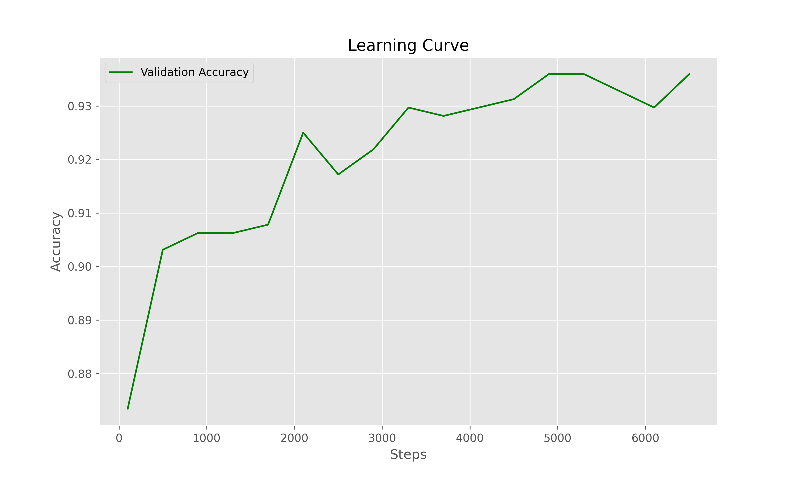
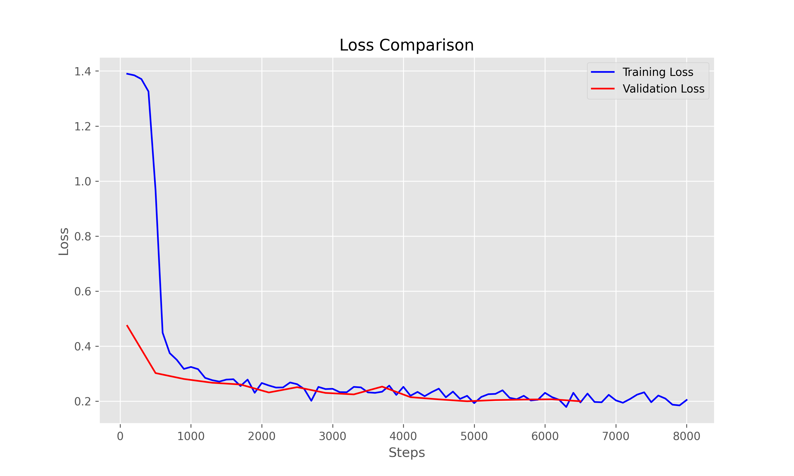
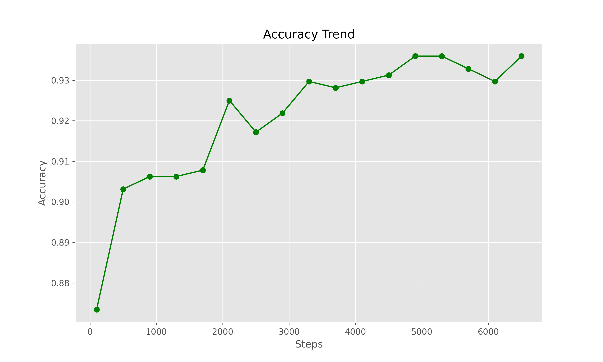
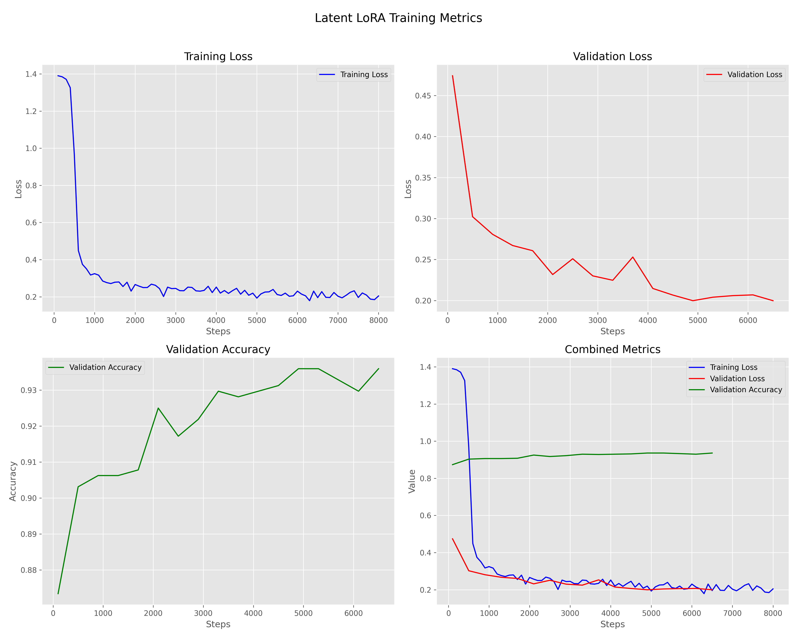

# AG News Classification with LoRA-Modified RoBERTa

This project implements a low-rank adaptation (LoRA) of the RoBERTa model for the AG News classification task, with a focus on parameter efficiency and training optimization.

## Competition Performance
**Rank: 24/185** with a test accuracy of **0.85500**

This performance was achieved using the submission file: [`submission_latent_lora_20250416_144307_l9-11_20250416_1601.csv`](submissions/submission_latent_lora_20250416_144307_l9-11_20250416_1601.csv)

## Current Best Model
[`dp_sp25_proj2/outputs/latent_lora_20250416_144307_l9-11_best/final_model`](outputs/latent_lora_20250416_144307_l9-11_best)

This is a latent layer LoRA model focused only on layers 9-11 of the original RoBERTa model. The model achieves excellent performance while using only 0.47% of trainable parameters compared to the full model.

### Model Configuration

- **Base Model**: RoBERTa-base
- **Task**: Sequence Classification (AG News - 4 classes)
- **Parameter Counts**:
  - Total Parameters: 125,316,104
  - Trainable Parameters: 593,668 (0.47%)
  - Non-trainable Parameters: 124,722,436 (99.53%)

For more detailed information, refer to the [model_description.txt](outputs/latent_lora_20250416_144307_l9-11_best/model_description.txt) and [model_description.json](outputs/latent_lora_20250416_144307_l9-11_best/model_description.json) files.

### LoRA Configuration

- **LoRA Rank (r)**: 8
- **LoRA Alpha**: 16
- **LoRA Dropout**: 0.1
- **Target Modules**: ['query', 'value']
- **Layers Transformed**: [9, 10, 11]
- **Number of Layers**: 3

### Training Process

The training process for this model is documented in the [training log](outputs/latent_lora_20250416_144307_l9-11_best/metrics/training_log.txt). This log was recreated from the saved metrics data using our `generate_training_log.py` script, as the original experiment was run before we fully implemented stdout logging in the training script.

The training log includes:
- Step-by-step training progress
- Training and evaluation loss
- Evaluation accuracy
- Final results summary

To regenerate the training log from the saved metrics, run:
```bash
python scripts/generate_training_log.py
```

### Training Performance

The model's training performance is visualized in several plots:

#### Learning Curve

*Shows the model's learning progress over training steps, demonstrating rapid convergence and stable learning.*

#### Loss Comparison

*Compares training and validation loss, showing good generalization with minimal overfitting.*

#### Accuracy Trend

*Tracks accuracy improvements during training, reaching high accuracy on the validation set.*

#### Training Metrics

*Comprehensive view of all training metrics, including loss, accuracy, and learning rate.*

These visualizations demonstrate that latent LoRA (applied to specific layers) provides better generalization than applying LoRA to all layers. Additionally, our experiments showed that data augmentation did not improve performance for this specific task.

## Project Structure

```
dp_sp25_proj2/
├── data/                   # AG News dataset
├── models/                 # Model checkpoints
├── outputs/               # Training outputs and logs
│   └── [latent_lora_20250416_144307_l9-11_best](outputs/latent_lora_20250416_144307_l9-11_best)/    # Best experiment output
│       ├── [final_model](outputs/latent_lora_20250416_144307_l9-11_best/final_model)/  # Best model checkpoint
│       ├── [metrics](outputs/latent_lora_20250416_144307_l9-11_best/metrics)/      # Training metrics and plots
│       ├── training_log.txt
│       ├── learning_curve.png
│       ├── loss_comparison.png
│       ├── accuracy_trend.png
│       └── training_metrics.png
│              
├── scripts/               # Training and evaluation scripts
│   ├── [train_latent.py](scripts/train_latent.py)   # Main training script
│   ├── [predict.py](scripts/predict.py)        # Prediction script
│   ├── [generate_model_description.py](scripts/generate_model_description.py) # Model description generator
│   └── [generate_training_log.py](scripts/generate_training_log.py) # Training log generator
└── src/                   # Source code
    ├── data/             # Data loading and preprocessing
    ├── models/           
    └── training/         
```

## Setup

1. Create and activate conda environment:
```bash
conda create -n dp_sp25_proj2 python=3.10
conda activate dp_sp25_proj2
```

2. Install dependencies:
```bash
pip install -r requirements.txt
```

## Usage

### Training

1. Run a single experiment:
```bash
python scripts/train_latent.py --exp_name "experiment_name" --batch_size 32 --learning_rate 2e-4 --start_layer 9 --end_layer 11
```

2. Run multiple experiments:
```bash
./run_experiments.sh
```

### Prediction

Generate predictions on test set:
```bash
python scripts/predict.py --model_dir outputs/latent_lora_20250416_144307_l9-11_best --batch_size 128
```

The script will:
- Load the best checkpoint from the specified model directory
- Generate predictions for the test data
- Save the predictions to a CSV file in the submissions directory

### Model Description

The model description files, [model_description.txt](outputs/latent_lora_20250416_144307_l9-11_best/model_description.txt) and [model_description.json](outputs/latent_lora_20250416_144307_l9-11_best/model_description.json), provide detailed information about the model configuration, including parameter counts and LoRA settings.

These files are generated using the `generate_model_description.py` script. To create these files, run:
```bash
python scripts/generate_model_description.py outputs/latent_lora_20250416_144307_l9-11_best
```
This script extracts model details and saves them in both text and JSON formats for easy reference and integration with other tools.

### Training Log

Generate a training log from saved metrics:
```bash
python scripts/generate_training_log.py
```

This script reads the saved metrics files and generates a comprehensive training log that includes:
- Model configuration
- Step-by-step training progress
- Final results summary

## Experiment Configuration

The following parameters can be configured in the training script:

- **Model parameters**: LoRA rank, alpha, dropout, target modules, layers to transform
- **Training hyperparameters**: batch size, learning rate, optimizer settings
- **Output and logging settings**: experiment name, output directory, logging frequency
- **Data settings**: dataset path, preprocessing options

## Outputs

- Model checkpoints are saved in [`outputs/latent_lora_20250416_144307_l9-11_best/final_model`](outputs/latent_lora_20250416_144307_l9-11_best/final_model)
- Training logs and metrics are saved in [`outputs/latent_lora_20250416_144307_l9-11_best/metrics`](outputs/latent_lora_20250416_144307_l9-11_best/metrics)
- Training log is available at [`outputs/latent_lora_20250416_144307_l9-11_best/metrics/training_log.txt`](outputs/latent_lora_20250416_144307_l9-11_best/metrics/training_log.txt)
- Model descriptions are saved as both JSON and text files
- Best performing models are tracked in Git

## Monitoring

- Training progress is displayed in real-time
- GPU memory usage is monitored
- Training metrics are saved and visualized as plots
- Early stopping is implemented to prevent overfitting